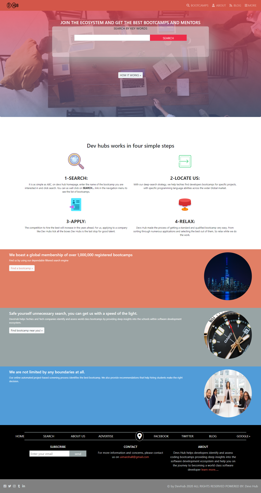

# html-css-capstone-project

## This project is built to reflects everything about html and css.

The project requirement was to build a hosted web page of three pages. The landing page for this web page is a search page which links to a results page , the result page then links to the details page. In this project i build a page where people can get a software development bootcamp and enrol.

## Getting Started

### Clone the repo on your system, find the index.html file and open with your browser

### Steps

**git clone** https://github.com/uimarshall/html-css-capstone-project.git

**cd** html-css-capstone-project

**download** code into your text editor

**open** the index.html in the browser

​
​

> ​
> 
> ​

## Built With

- HTML
- CSS
- Fontawesome
  ​

## Live Demo

​
[Live Demo Link](https://rawcdn.githack.com/uimarshall/html-css-capstone-project/2b97549e209db8e1e48315f421635b8cd9e4d7e6/index.html)

## Link to Video Demo

​
[Link to Video Demo](https://www.loom.com/share/45d54cee22704f74bdaa6ee184f6217a)
​

## Authors

#### 👤 **Marshall AKPAN**

​

- Github: [@uimarshall](https://github.com/uimarshall)
- Twitter: [@uimarshall](https://twitter.com/uimarshall)
- Linkedin: [uimarshall](https://www.linkedin.com/in/marshall-akpan-19745526/)

​

## �� Contributing

​
Contributions, issues and feature requests are welcome!
​
Feel free to check the [issues page](https://github.com/uimarshall/html-css-capstone-project/issues).
​

## Show your support

​
Give a ⭐️ if you like this project!
​

## Acknowledgments

- Fontawesome
- Our Stand up teams
- Microverse TSE
- Google fonts
- Twitter Bootstrap

  ​

## �� License

​
This project is [MIT](lic.url) licensed.
